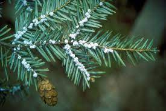
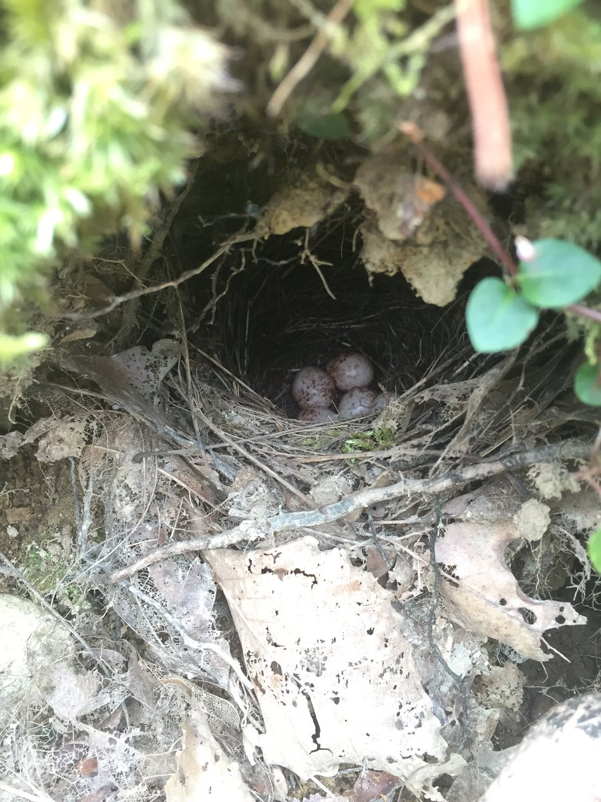

```{r setup2, include=FALSE}
knitr::opts_chunk$set(echo = TRUE)
packages_needed <- c("ggplot2", # graphics
                     "plyr",
                     "arm", # display() etc.
                     "MASS",
                     "dplyr",
                     "ggfortify",
                     "janitor")
pk_to_install <- packages_needed [!( packages_needed %in% rownames(installed.packages())  )]
if(length(pk_to_install)>0 ){
  install.packages(pk_to_install,repos="http://cran.r-project.org")
}
#lapply(packages_needed, require, character.only = TRUE)
library(ggplot2)
library(plyr)
library(arm)
library(MASS)
library(dplyr)
library(ggfortify)
library(janitor)
library(dslabs)
```




$~$

The hemlock woolly adelgid (*Adelges tsugae*) is a species of insect that exclusively feeds on hemlock trees. In the early 1950s, this insect was introduced into the eastern United States, and since that has been responsible for a severe decline of the eastern hemlock (*Tsuga canadensis*). This tree species often grows in moist ravines, and is an important component of the vegetation in these riparian areas. Among other species, the tree shares this habitat with the Louisiana Waterthrush (*Parkesia motacilla*), an obligate riparian songbird. Using this data set, I analyzed the impact of hemlock decline on the nest success of Waterthrush in the Great Smoky Mountains.  



$~$

First, I cleaned up the data in Excel and read it into R, then removed any remaining "NA" values. I used the "colnames" function to change the names of the relevant columns, as "nest_status" was labeled as "f" in the original dataset.  

```{r Nest Survival}

lowa_survival <- read.csv("data/Bryantetal_LOWA_NestSurvivalAnalysis_data.csv")%>%na.omit(lowa_survival)

colnames(lowa_survival)<-c("ID", "nest_status", "hemlock_decline")

```

$~$

I created a simple ggplot to first visualize the data. Counter-intuitively, the researchers coded a nest success as a 0 and a failure as a 1. 

$~$

```{r Survival Fit}

ggplot(lowa_survival,aes(hemlock_decline, nest_status)) +
  geom_point() +
  geom_smooth() +
  xlab ("Hemlock Decline (0-1.00)") +
  ylab ("Nest Fate") +
  labs(title="Raw Fit: 1=nest failure, 0=nest success")

```
```{r Fig 1.2}
lowa_survival$hemlock_decline <- lowa_survival$hemlock_decline
fit.1 <- glm(nest_status~hemlock_decline, data=lowa_survival, binomial(link="logit"))
autoplot(fit.1)
```


$~$
I ran a binned residual plot to check the dispersion, and found that the majority of the data fell within the 95% Confidence Interval. 
$~$


```{r Fig 1.3 Binned Plot}
library(arm)
x <- predict(fit.1)
y <- resid(fit.1)
binnedplot(x, y)

```


$~$
I next found the coefficient of the GLM, as one does. 
$~$


```{r coefficients fit.1}
coef(fit.1)
confint(fit.1)


(coef(fit.1)[2])/4

```

$~$

Based on the coefficient, there was no effect of hemlock decline on nest success. Using the "divide by four" rule, there is a slight increase in the chance of nest success per 12% decline in hemlock. 

To confirm, I constructed a ggplot using the GLM for smoothing, and again fit the GLM and found the coefficient. 

$~$

```{r Figure 1.4}
ggplot(lowa_survival, aes(hemlock_decline,nest_status)) +
  geom_point() +
  geom_smooth(method="glm", method.args=list(family="binomial"(link="logit"))) + 
  xlab ("Hemlock Decline") +
  ylab ("Nest Fate")

```


``` {r Fit 2}

fit.2 <- glm(nest_status~hemlock_decline, binomial(link="logit"), data= lowa_survival)
display(fit.2)
```

```{r coefficient fit 2}
confint(fit.2)
```

```{r Summary}
summary(fit.2)
```
$~$
Based on the plot and the p-values in the summary, there is no effect of hemlock decline on the probability of nest success in Louisiana Waterthrush.
$~$


$~$

Piping Plovers (*Charadrius melodus*) is a small migratory shorebird that breeds beaches along the East Coast of the United States and along waterways in the Midwest. The dataset used here came from a manuscript assessing whether Piping Plovers adhere to Bergmann's Rule, but I used it to assess the relationship between body mass and wing length in this species. 


The first step was using the package "janitor" to clean up the column names.

$~$


```{r Plover}

load("data/plover_bergmann.rdata")
plover_bergmann <- clean_names(df)


```

$~$

I then ran a Gaussian GLM on the data, and assessed the model using anova(). I created a scatterplot and used GLM for smoothing. Because the wing length of the birds is a non-negative continuous variable, I used a gamma distribution. 

$~$

```{r anova}

plover.ml1 <- glm(wing~mass, data= plover_bergmann, family= gaussian(link="identity"))
anova(plover.ml1)

```

```{r GLM plot, message=FALSE, warning=FALSE}

plover.gamma <- glm(wing~mass, data= plover_bergmann, family=Gamma(link= "sqrt"))

ggplot(plover_bergmann,aes(mass,wing)) + 
  geom_point() +
  geom_smooth(method="glm",colour="red",
                         method.args=list(family="Gamma"(link="sqrt")))+
  labs(title="GLM, square-root link, Gamma variance")

```

```{r message=FALSE, warning=FALSE}
coef(plover.gamma)
confint(plover.gamma)
```

$~$ 

There is a clear increase in wing length as the mass of an individual increases. However, based on the scatterplot, a Gaussian model does not appear to be the best test for this dataset. 

To double-check this, I ran a linear regression model, and created an autoplot. It would probably be more efficient to do this first. 

$~$


```{r Linear Model}

ggplot(plover_bergmann, aes(x=mass, y=wing)) + 
  geom_point()+
  geom_smooth(method=lm)

## Normal least squares linear regression using lm(): 
plover.ls1 <- lm(wing~mass, data = plover_bergmann)

autoplot(plover.ls1)

```

$~$
There does not appear to be any difference between the generalized linear model and the linear regression, confirming my suspicion that a Gaussian model does not best fit this data. I finished ran a boxcox transformation on the linear regression, and found that the lambda value was closest to 1. Based on this, no transformation is needed.

$~$

```{r plover box cox}
boxcox(plover.ls1)
```


